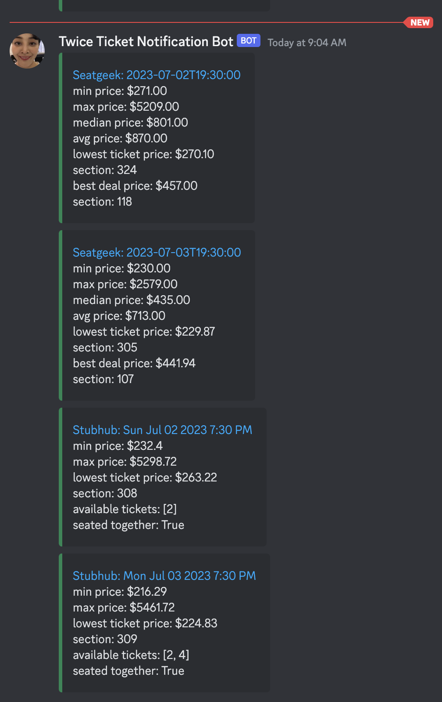

# ticket-price-bot

## Premise

Unable to purchase tickets to see a concert in Toronto for a performer's first time in Canada, I wanted to automate checking ticket resellers for the cheapest seats every day. I decided to write a script to check prices for me, then send me updates on Discord, using a scheduled Github Action.

#### Update: I got tickets!

2023-05-25: This bot scraper now parses event names from `Seatgeek` and `Stubhub` and names the bot directly after the event name. Hence, the bot name will be called `<event_name> Ticket Notification Bot`. This is to prevent confusion when running multiple bots for different events.

## Dependencies

```python
uv >= 0.4.27
```

## Usage

1. Clone/fork the repository

2. Install dependencies

```bash
uv sync # If uv.lock exists
uv pip sync pyproject.toml # If uv.lock does not exist
```

3. Replace the values in `input/input.txt` with links to the events you want to track. Right now, the script only works for ~~`SeatGeek`~~ and `Stubhub`.

> Why is this manual? Ticketmaster blocks `Selenium` and `requests` anyways, but I don't want to write a scraper for every ticket vendor. If you want to use this for a different vendor, you'll have to write your own scraper. Also, I don't want to build a bot to handle user input, and I don't want to automate buying tickets, since I want to check prices myself. Otherwise, I'd be no better than a ticket scalper, and this bot is not meant to scalp tickets. I just want tickets to see Twice.

> Update 2024-10-28: For the past couple of months, Seatgeek has been blocking scraping requests, so only Stubhub continues to work. However, for how long remains to be seen. Viagogo seems to be a viable target in the near future.

4. Copy `.env.example` to `.env` and in your target Discord server, provided you have admin privileges, create a webhook and paste the URL into the `.env` file. If you're running this as a Github Action, you'll need to add the webhook URL as a secret in `Settings > Secrets and Variables`.

```bash
WEBHOOK_URL={your-discord-server-webhook-url}
```

## Running the script on Github Actions

I automated this using Github Actions since I don't need a script running 24/7, just once an hour. I was also moving at the time, so couldn't run it as a cron job on my Raspberry Pi. Finally, I didn't want to run a VM in Azure since it seemed wasteful to spin up a machine for a script that takes a minute to run. If you want to run this locally, you can use `cron` to schedule the script to run every hour.

### What it looks like


